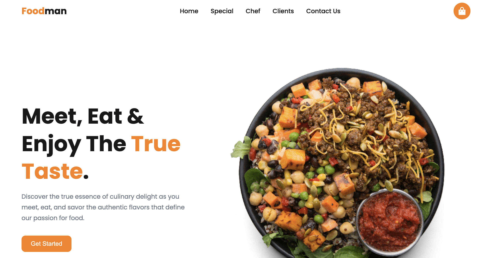
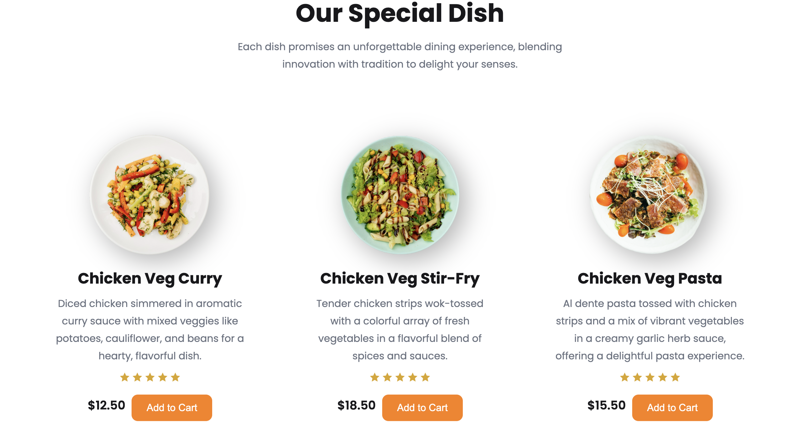
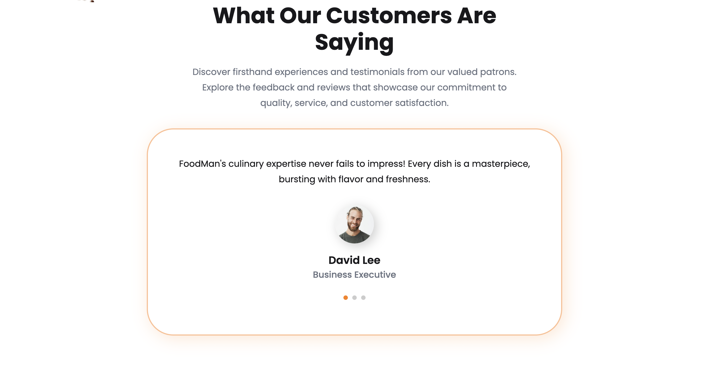

# Foodman App 🍴

Foodman is a modern and responsive web application designed for food enthusiasts. It provides a seamless experience for users to explore, order, and enjoy delicious meals. The app features a visually appealing design, smooth animations, and interactive elements to enhance user engagement.

## Live Demo 🌐

Check out the live version of the Foodman app here: [Foodman Live](https://foodman-blond.vercel.app/#) 

## Screenshots 📸

### 1. **Homepage**

### 2. **Special Dishes Section**

### 3. **Chef Section**

### 4. **Customer Testimonials**

## Features 🚀

- **Responsive Design**: Fully optimized for all devices, including desktops, tablets, and mobile phones.
- **Interactive Navigation**: Smooth scrolling and a responsive navigation menu.
- **Special Dishes Section**: Highlights the top dishes with ratings and pricing.
- **Chef Section**: Showcases the expertise of world-class chefs.
- **Customer Testimonials**: Displays feedback from satisfied customers using a swiper slider.
- **Footer Links**: Provides quick access to product, company, and information pages.
- **Scroll Animations**: Engages users with smooth animations powered by ScrollReveal.
- **Swiper Integration**: Implements a swiper slider for customer testimonials.

## Technologies Used 🛠️

- **HTML5**: For structuring the content.
- **CSS3**: For styling and layout, including responsive design.
- **JavaScript**: For interactivity and animations.
- **Swiper.js**: For the testimonial slider.
- **ScrollReveal.js**: For scroll animations.
- **Remixicon**: For icons used throughout the app.

## Folder Structure 📂

GitHub Copilot
Searched assets for "Foodman app", no results

Here is a readme.md file for your Foodman app:

Foodman/ ├── assets/ │ ├── chef.png │ ├── client-1.jpg │ ├── client-2.jpg │ ├── client-3.jpg │ ├── explore.png │ ├── header.png │ ├── special-1.png │ ├── special-2.png │ ├── special-3.png │ ├── topping.png ├── index.html ├── styles.css ├── main.js └── readme.md 

## How to Use 🖥️

**1. Clone the repository:**
   git clone https://github.com/your-username/foodman.git
   
**2.Navigate to the project directory:**
    cd foodman
    
**3.Open index.html in your browser to view the app.**

**Made by**
HIKMAT NASIBLI